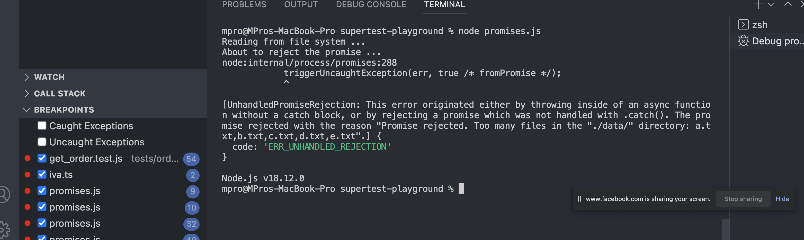

# Part 5: Promises 

## GitHub Repo → [`promises-playground`](https://github.com/ivaaaa/promises-playground)

### Figure out what are Promises and how they work

Quick read: 
- 📌 Promises in [MDN docs](https://developer.mozilla.org/en-US/docs/Web/JavaScript/Reference/Global_Objects/Promise)

Examples in the repo!

#### Be aware of: unhandled promise rejections ❌

#### Links and readings: 

- Bookmark: 
    - [`setTimeout`](https://developer.mozilla.org/en-US/docs/Web/API/setTimeout)` global function 
    - 📌 Node.js `fs` module [docs](https://nodejs.org/api/fs.html) 
    - 📌 Node.js `process` module [docs](https://nodejs.org/api/process.html#processcwd)
