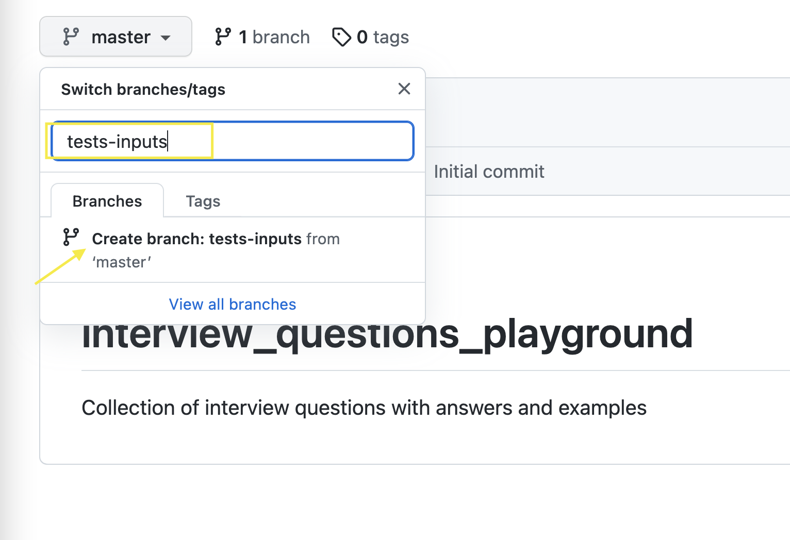

# Part 7 appendix-a: Git branches and Pull Requests

### Working from a “feature” branch

*Your feature branch will live as long as you are working on the feature, once you merge your feature branch into master, your feature branch is no longer needed, you can delete it after the PR is merged*

## Git Workflow 

- go to https://github.com/ivaaaa/webdriverio_playground and create new branch with name `tests-inputs` (this is your feature branch)
    
    
    
- 👆at this point **remote** **origin** `tests-inputs` branch exists
- go to `vscode`'s *Terminal* and run `git pull` while on `master` branch
- 👆this will update your local `master` with latest changes from origin & it will create your local version of `tests-inputs` branch
- next, run `git checkout tests-inputs` to switch from `master` to newly created `tests-inputs` branch
- ⌨️ now write your code … at some point you will want to commit your changes
    - `git add .` to move all file changes from git’s *working directory* to *staging index* (when changes are in *staging index* ie “staged” those changes are *ready to be committed*)
    - `git commit -m "adding changes to this and that"` to make a commit
    - 👆at this point your commit is the HEAD of your local `tests-inputs` branch (remote branch is still unaware of this commit)
    - `git push` to push your commit to remote `tests-inputs` branch
    - 👆 now your commit is the HEAD of your remote `tests-inputs` branch as well
- ⌨️ make more changes … push more commits … at some point you will be done
- go to https://github.com/ivaaaa/webdriverio_playground and create na *Pull Request* (PR) to `merge` your changes from `tests-inputs` into `master` branch
- … review process happening …
- ⌨️ make more changes to address PR comments … push more commits … at some point you will be done with the PR, someone will `approve` your PR, and PR will be *ready for merge* 🎉
- go to https://github.com/ivaaaa/webdriverio_playground and merge your Pull Request by clicking on `Merge` button
- at this point you can
    - go back to `master` by running `git checkout master` in your *Terminal*
    - delete `tests-inputs` branch (remote one) in GitHub (fyi - no need to delete `tests-inputs` local version of the branch from *Terminal*)

### Additional Notes

- at any point, if you want to *update your local `tests-inputs` branch with latest changes from `master`* → run following command (while on `tests-inputs` branch):
    - `git pull origin master`
    - `git push`
    - 👆if you branch was *behind* master, at this you will have new “merge” commit on remote `tests-inputs` branch that updates it with latest changes from `master` (`tests-inputs` becomes *in sync* with `master`)
    - 👆if your branch was already *up to date* with master, there will be no commit (nothing to commit, nothing to be pushed)

--- 

:point_left: [go back to main page](../README.md)